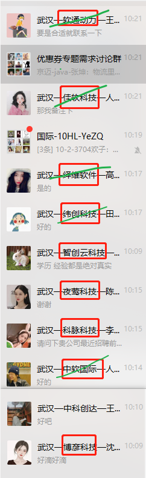

纬创软件(15)
国家电网
武汉软件新城,洪山区花城大道9号(大巴,一小时左右)

软通动力(16+)
不外派，做的华为的项目
花山软件新城就是我们自己的场地(大巴,一小时左右)

vue3 + ant + ts + vite

奇安信(15-25K·14薪)
<!-- 1、熟练使用AngularJS, React或vue中至少一个框架，并有项目实践
2、熟练运用前端打包、构建工具（如webpack, gulp）
3、有图形、图表开发经验，包括但不限于D3、threejs、webgl -->
光谷梦工厂(地铁,三十多分钟)
https://www.zhipin.com/job_detail/8d83305bcac9c3621nx92tq6E1M~.html?ka=search_list_jname_2_blank&lid=1mWbelIDTeZ.search.2&securityId=mmjfnzEd8rM2k-R1v38fL84ilFYAtzyPax_KHoXKczSOkihEmocAsO1OGyrrNGtJY4bTM4Z1D6gki258FLTdLEAbBwPawcoYNT-HP6gkn4_Bd3jN

佳软(15嫌多了)

夜莺科技
995
9:00 -- 12:00
14:00 -- 18:00
18:00 -- 21:00

职位描述：
【职位职责】
1. 负责微伴助手相关项目（Web、H5、小程序）的开发、架构设计、优化工作；
2. 制定前端开发规范，优化需求上线流程，确保产品的交付质量和效率，保障产品和服务的稳定性。

【职位要求】：
1. 学历不限，3年以上Web前端相关工作经验，有扎实的计算机学科和网络知识基础；
2. 能够熟练使用 Git 并掌握 Git 相关原理；
3. 熟悉微信公众号、小程序的开发；
4. 熟悉主流开发框架，熟练掌握 Vue 或 React，对前端工程化、组件化、模块化有一定理解和思考；
5. 有优秀的逻辑思维和表达能力；
6. 对技术有追求，有学习的欲望和执行力；

【加分项】：
1. 具备一定的组建团队和项目管理的能力；
2. 对JS新特性、前端性能优化等有深刻理解；
3. 有Linux/Mac系统命令行的使用经验；
4. 深入了解 TypeScript 并在工作中使用过；
5. 具有大型 Web 前端项目开发经验；
6. 了解 Nodejs，具备一定的全栈开发能力。

【做更好的选择】
武汉夜莺科技有限公司是一家专注于智能营销领域的科技公司。
于2016年获得知名投资机构真格基金投资；
于2018年获得近千万元战略融资。
核心业务微伴助手、壹伴助手直接或间影响国内数亿用户。
3年内公司估值上涨百倍，除此之外，目前仍在超高速上涨！
在夜莺科技=薪资水平高+福利多+氛围好+5A写字楼办公环境+大牛多+管理扁平+双休+涨薪快+弹性工作+零食下午茶+生日庆祝+节日大礼包+学习报销等等！
加入我们，在高速增长的企业中高速成长，和优秀的人一起创造更大的价值。
工作地址
武汉 - 洪山区 - 光谷 - 光谷新世界写字楼T1




二面可能考察

node
性能
ts
shell
可视化
docker
!!! vue的双向绑定,数据驱动,渲染机制...
网络机制
webide
代码版本管理
前端工程化、组件化、模块化
CI/CD/测试
webpack

webpack 插件,去除代码中的 console.log

```js
new webpack.optimize.UglifyJsPlugin({
compress: {
  warnings: false,
  drop_debugger: true,
  drop_console: true
},
  sourceMap: true
}),
```

正则去除 console.log();

console\.log\(.*\);

正则去除 console.log();123
正则去除 console.log('', a());123
正则去除 console.log('', a())))))))))+)))));
正则去除 console.log('', a())))))))))+));

## 中职物联

### 需熟练掌握vue2.0

- Vue编译原理这块的整体逻辑主要分为三步：

第一步将模版字符串转换成element ASTs(解析器)
第二步是对AST进行静态节点标记，主要用来做虚拟DOM的渲染优化(优化器)
第三步是使用element ASTs生成render函数代码字符串(代码生成器)

解析器（parser）的作用是将 模板字符串 转换成 element ASTs。
优化器（optimizer）的作用是找出那些静态节点和静态根节点并打上标记。
代码生成器（code generator）的作用是使用 element ASTs 生成 render函数代码（generate render function code from element ASTs）

### flex布局

- 设置在容器上
 - flex-direction
 - flex-wrap
 - flex-flow
 - justify-content
 - align-items
 - align-content

- 设置在 item 上
 - flex-grow
 - flex-shrink
 - flex-basis
 - flex
 - align-self

### css3D变换

```css
.ctn1 {
  transform-style: preserve-3d;
  perspective: 200px;
  perspective-origin: 50% 50%;
  backface-visibility: hidden;
}
.ctn1 .ctt {
  transform: rotateY(30deg) translateX(-50%);
}
```

### 会vue3.0+ts的优先

### 熟练使用echart或G2的优先

- 无障碍花纹: 贴花图案作为颜色的辅助表达，进一步用以区分数据。在 aria.enabled 为 true 的前提下，将 aria.decal.show 设为 true 即可采用默认的贴花样式。(如果需要自定义贴花图案，可以使用 aria.decal.decals 配置出灵活多变的图案。)
- echarts.graphic.LinearGradient
- 按需引入

### 问面试官

数据可视化页面需适配的尺寸
是否需要响应式
开发模式
页面resize
echart的封装,组件的封装,模板页面

武汉 - 东湖新技术开发区 - 光谷新世界T1写字楼3104

资料整理:
  => pdf
  => 简历风格

整理组件截图
项目截图脱敏

AdassBox:
  广东地图截图


技术栈选择
物料准备
性能考虑
测试和自动化构建

- 技术要点:
  - Vue3 + ts + echarts
  - webpack / vite
  - 响应式 & 自适应
  - jest
  - CI / CD
  - 面向对象
  - 设计模式
- 性能优化:
  - 路由懒加载
  - 异步组件
  - 将这些不用改变的数据通过Object.freeze方法冻结它，避免vue初始化的时候，做一些无用的操作(vue2)
  - 页面 resize 节流 => echarts resize
- 代码优化
  - 利用解构 `{$attrs,$route,$store,$listeners,$ref}`
- 项目物料:
  - 样式格式化
  - 工具类封装
  - 功能类组件
  - 展示类组件
  - 页面模板类

---

- 几个复杂组件开发
  - echarts 地图
  - 3D 轮播
  - 3D 饼图
  - 3D 堆图
  - 数字翻牌

- echarts
  - 封装成组件，接收 option 配置项，和展示数据做计算
  - 处理事件监听 & 监听事件的删除

- 标签自动播放
  - 可以使用 UI 组件库的标签切换组件，定时切换激活标签
  - 或者自己通过动态组件实现

- 页面播放切换(考虑优化体验)
  - 切换: 使用 vue 的 transition 标签包装路由 `<transition :name="transDir"><keep-alive></keep-alive></transition><router-view>`, 然后结合 css 动画
  - 懒加载: 首页使用(先加载优先级高的内容/骨架屏/等待动画)
  - 预加载:
    - 下一个切换的页面,在对应的路由钩子中,判断内容加载情
    - 打包配置禁止预加载

    ```js
    module.exports={
    	chainWebpack:config=>{
    		config.plugins.delete("prefetch") //取消预加载
    	}
    }
    ```

  - 分析项目打包资源情况 `npm run build --report`
    - 使用 cdn 引入第三方库文件
    - 使用打包工具配置按需加载
    - 路由懒加载
    - 打包工具 & nginx 开启 gzip
    - 静态资源缓存

  - Vue 官方异步组件 AsyncComponent

- vue3
- git 分支管理
- 测试
- CI/CD

> 参考文章：
> [vue多页面首页加载优化](https://zhuanlan.zhihu.com/p/46966031)

📌 项目构建初步思考
🚀 技术选择
Vue3 + ts + echarts
webpack / vite
响应式 & 自适应
🚀 项目物料
reset styles
图片素材, 合适的开源字体, icon fonts
工具类封装
Number 数据格式化
日期格式化
Promise 定时任务(一定时间后处理例如关闭消息通知等任务)
功能类组件
echarts
模态框(弹窗组件)
其他常用展示形式
展示类组件
页面模板类
mock 数据
🚀 性能优化
代码压缩
提取公共内容
路由懒加载
异步组件
节流
及时清理事件
缓存
...
🚀 接入测试和CI/CD

中诚信国际
武昌 中北路

长江信达
长江设计院
江岸区 永青路
